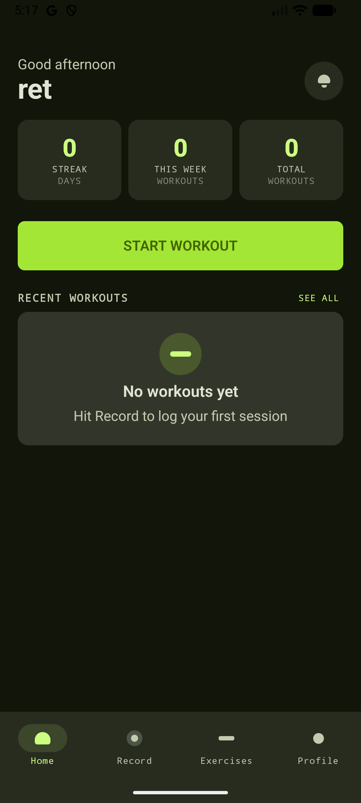

# FitTrack

A Kotlin Multiplatform fitness tracking app targeting **Android**, **iOS**, and a **Ktor backend server** backed by PostgreSQL.

---

## Screenshots

> _Add screenshots to `docs/screenshots/` and update the paths below._

| Home | Workouts | Log Workout | Profile |
|------|----------|-------------|---------|
|  |  |  |  |

---

## Project Structure

| Module | Description |
|--------|-------------|
| [`/composeApp`](./composeApp/src) | Shared Compose Multiplatform UI (Android + iOS) |
| [`/iosApp`](./iosApp) | iOS app entry point (Xcode / SwiftUI shell) |
| [`/server`](./server/src/main/kotlin) | Ktor JVM backend server |
| [`/shared`](./shared/src) | Shared business logic, models, and database (SQLDelight) |

---

## Prerequisites

- **JDK 17+**
- **Android Studio** (Hedgehog or newer) with KMP plugin
- **Xcode 15+** (for iOS)
- **Docker & Docker Compose** (for running the server + database locally)

---

## Running the Backend Server

### Option A — Docker Compose (recommended)

Starts the Ktor server and a PostgreSQL 16 database together:

```shell
docker compose up --build
```

The server will be available at `http://localhost:8080`.

To start only the database (and run the server from your IDE / Gradle):

```shell
docker compose up db
```

To tear down and wipe all data:

```shell
docker compose down -v
```

### Option B — Gradle (database must be running separately)

1. Start the database:
   ```shell
   docker compose up db
   ```

2. Run the server:
   ```shell
   # macOS / Linux
   ./gradlew :server:run

   # Windows
   .\gradlew.bat :server:run
   ```

The server reads the following environment variables (defaults shown):

| Variable | Default | Description |
|----------|---------|-------------|
| `PORT` | `8080` | HTTP port the server listens on |
| `DB_URL` | `jdbc:postgresql://localhost:5432/fittrack` | JDBC connection URL |
| `DB_USER` | `fittrack` | Database user |
| `DB_PASSWORD` | `secret` | Database password |
| `JWT_SECRET` | _(required)_ | Secret key used to sign/verify JWT tokens |

---

## API Endpoints

All authenticated routes require a `Bearer` JWT token in the `Authorization` header obtained from `/auth/login`.

| Method | Path | Auth | Description |
|--------|------|------|-------------|
| `POST` | `/auth/register` | No | Register a new user |
| `POST` | `/auth/login` | No | Login and receive a JWT token |
| `GET` | `/me` | Yes | Get current user profile |
| `PATCH` | `/me` | Yes | Update current user profile |
| `GET` | `/exercises` | Yes | List all exercises |
| `GET` | `/workouts` | Yes | List user workouts |
| `POST` | `/workouts` | Yes | Create a new workout |
| `GET` | `/workouts/{id}` | Yes | Get a specific workout |
| `PUT` | `/workouts/{id}` | Yes | Update a workout |
| `DELETE` | `/workouts/{id}` | Yes | Soft-delete a workout |
| `GET` | `/sync/status` | Yes | Get sync status for the user |

---

## Building the Android App

```shell
# macOS / Linux
./gradlew :composeApp:assembleDebug

# Windows
.\gradlew.bat :composeApp:assembleDebug
```

Install directly on a connected device or emulator:

```shell
./gradlew :composeApp:installDebug
```

---

## Building the iOS App

1. Open the [`/iosApp`](./iosApp) directory in Xcode.
2. Select your simulator or device.
3. Press **Run** (`Cmd+R`).

Alternatively, build the shared KMP framework first:

```shell
./gradlew :shared:assembleXCFramework
```

---

## Running Tests

```shell
# All tests
./gradlew test

# Server tests only
./gradlew :server:test

# Shared unit tests
./gradlew :shared:jvmTest
```

---

## Further Documentation

- [`docs/BACKEND.md`](docs/BACKEND.md) — Server architecture and design
- [`docs/DATABASE.md`](docs/DATABASE.md) — Local database schema (SQLDelight)
- [`docs/DESIGN.md`](docs/DESIGN.md) — App design decisions
- [`docs/TESTING.md`](docs/TESTING.md) — Testing strategy
- [`docs/PRD.md`](docs/PRD.md) — Product requirements

---

## Tech Stack

- **Kotlin Multiplatform** — shared code across Android, iOS, and server
- **Compose Multiplatform** — shared UI
- **Ktor 3** — backend HTTP server (Netty)
- **PostgreSQL 16** — server-side database
- **SQLDelight 2** — local database (Android + iOS)
- **Koin** — dependency injection
- **kotlinx.serialization** — JSON serialization
- **JWT (auth0/java-jwt)** — authentication tokens
